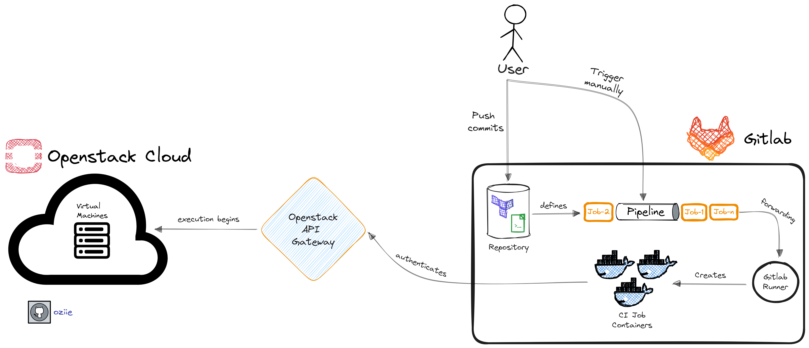

# gitops-on-openstack
Created with purpose of apply GitOps practices on Openstack platform with help of IaC tool Terraform and CI/CD solution GitLab

*Note:* 📢 *This repository made public from a private repository initially. Developments will continue through files made available to the public.*
*Distinguishing clause used: ROOT_COMMIT - making public commit*

## 📋 Requirements

1. **Openstack**
    
    - User Authentication
    - Project
    - Project API Authorization (at least, ability to create images/instances etc.)

2. **Terraform**

    - Desired Terraform resources coding in *.tf files

3. **Gitlab**

    - CI/CD Pipeline

        - Pre-defined variables

    - Secrets

***NOTE:*** As originally, a proxy used while execute tasks on this repository, you will see proxy address details in files/variables($HTTP_PROXY, $HTTPS_PROXY). If you don't need to use a proxy, make required actions and remove them from files.


## ⚙️ How does it work?

- User provides the mentioned requirements in CI/CD pipeline accordingly to create desired infrasctructure resource via Terraform in Openstack platform.

- Before each trigger of the pipeline, addition to required variables, user provides few important variables as desired. Otherwise, default variables apply on the resource. Thus, state management can be visible and manageable on Gitlab and confusion can be avoided.

    ```` 
    - TF_STATE_NAME
    - OPENSTACK_IMAGE_NAME
    - OPENSTACK_FLAVOR_NAME
    - OPENSTACK_VM_NAME
    ````
- CI/CD pipeline runs with single click and execute 5 stages automatically or manually depends on the needs.

    ```` 
    - tests (auto)
    - validate (auto)
    - plan (manual)
    - apply (manual)
    - destroy (manual)
    ````

- Gitlab creates CI job containers and authenticate **Openstack API Gateway**.

- Then, resources creates under the Openstack project mentioned.


## 🔭 HLA - High Level Architecture




## 🧐 LLW - Low Level Workflow


## 🧮 CI/CD Variables

CI/CD variables that required to be used in the pipeline. Values are for example purposes only.
Values can be set under ***"Settings -> CI/CD -> Variables"***.

| Key | Value | Protected | Masked |
| ----- | ----- | ----- | ----- |
| HTTP_PROXY | http://PROXY_ADDRESS | no | yes |
| HTTPS_PROXY | http://PROXY_ADDRESS| no | yes |
| INFRA_CREATION_PLAN_NAME | infrastructure_creation_plan | no | no |
| OPENSTACK_APPLICATION_CREDENTIAL_ID* | CONFIDENTIAL | yes | yes |
| OPENSTACK_APPLICATION_CREDENTIAL_SECRET* | CONFIDENTIAL | yes | yes |
| OPENSTACK_AUTH_TYPE* | CONFIDENTIAL | yes | yes |
| OPENSTACK_AUTH_URL* | CONFIDENTIAL | yes | yes |
| OPENSTACK_FLAVOR_NAME | vCPU:8-RAM:8192[MB]-Disk:320[GB] | no | no |
| OPENSTACK_IDENTITY_API_VERSION | 3 | no | no |
| OPENSTACK_IMAGE_NAME | centos8.2-cloudimg | no | no |
| OPENSTACK_INTERFACE* | public | yes | no |
| OPENSTACK_KEY_PAIR_NAME | gitops_key_pair | no | no |
| OPENSTACK_NETWORK_NAME | openstack-network | no | no |
| OPENSTACK_PROJECT_NAME | team_devopsstack | no | yes |
| OPENSTACK_REGION_NAME* | CONFIDENTIAL | yes | yes |
| OPENSTACK_VM_NAME | GitOps-VM | no | no |
| TF_HTTP_ADDRESS** | $CI_API_V4_URL/projects/$CI_PROJECT_ID/terraform/state/$TF_STATE_NAME | no | no |
| TF_HTTP_PASSWORD*** | CONFIDENTIAL | yes | yes |
| TF_HTTP_USERNAME | oziie | no | no |
| TF_STATE_NAME | gitops_vm_state | no | no |


***Confidentiality Notes***:

- "*" these values can be found in "clouds.yaml"
- "**" "TF_HTTP_ADDRESS" contains [pre-defined values](https://docs.gitlab.com/ee/ci/variables/predefined_variables.html): CI_API_V4_URL and CI_PROJECT_ID.
- "***" "TF_PASSWORD" corresponds "CI_JOB_TOKEN" which creates under the ***"Settings -> Access Tokens"***. ( with "api, read_api, read_repository, write_repository" rights.)

## 🧰 Tool & Platform Versions

| Tools | Version |
| ----- | ------- |
| Terraform  | 1.4 |
| Openstack | 2023.2 |
| Gitlab  | 14.10.5 |